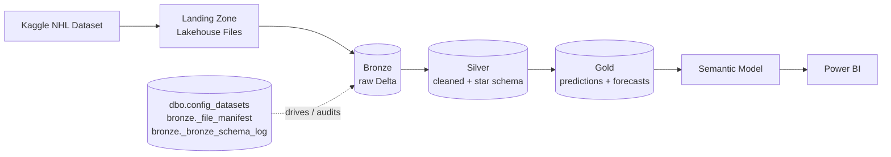

# NHL Performance Predictor

An end-to-end analytics project on **Microsoft Fabric** that ingests public NHL game data, refines it through a medallion (bronze → silver → gold) lakehouse, produces team, player and betting-market predictions, and serves the results to **Power BI** through a semantic model.

---

## Tech Stack

| Area | Technology |
|------|------------|
| Platform | Microsoft Fabric |
| Storage | OneLake / Fabric Lakehouse (Delta tables) |
| Transformation | Fabric Notebooks (PySpark) |
| Orchestration | Fabric Data Pipeline |
| Testing | Python `unittest` (run in notebooks) |
| CI/CD & Source Control | Azure DevOps (Repos, Boards, Pipelines) |
| Serving | Fabric Semantic Model |
| Reporting | Power BI |

---

## Architecture

A Fabric **Data Pipeline** runs the notebooks in order, and the whole project is version-controlled in an **Azure DevOps** repository.

---

## Repository Layout (Notebooks)

| Notebook | Purpose |
|----------|---------|
| `nb_00_setup_config` | Creates the `bronze`, `silver`, `gold` schemas and the `dbo.config_datasets` metadata table |
| `nb_00_dbutils` | Shared helpers: incremental reads, dedup, data-quality checks, Delta upsert/write |
| `nb_01_test_*` | `unittest` suites for the shared utilities and silver logic |
| `nb_02_landing_bronze_functions` | Ingestion helpers (file change detection, schema drift, hashing, idempotent load) |
| `nb_02_landing_to_bronze` | Downloads source files to landing, then loads them to bronze |
| `nb_03_1` – `nb_03_3_*_silver` | Per-table cleaning and validation into silver |
| `nb_03_4_*_silver` | Star-schema modelling and rolling matchup features |
| `nb_04_*_gold` | Forecasts, predictions and Power BI-ready gold tables |

---

## Metadata-Driven Design

The pipeline is controlled by small metadata tables rather than hard-coded logic, so adding a dataset is a configuration change, not a code change.

| Table | Layer | Role |
|-------|-------|------|
| `dbo.config_datasets` | Config | One row per source file: target bronze table, Kaggle dataset, source file, columns used for the row hash, CSV options, and an `is_active` flag. Notebooks read active rows and loop over them. |
| `bronze._file_manifest` | Audit | Stores the SHA-256 hash of each landed file. Unchanged files are skipped on later runs. |
| `bronze._bronze_schema_log` | Audit | Records schema drift (new or missing columns) detected on each load, with a timestamp and table name. |

Rows in bronze and silver also carry technical columns (`_source_file`, `_ingestion_timestamp`, `_row_hash`, `_bronze_ingested_at`) that support lineage, incremental loading and deduplication.

---

## Medallion Layers

### Landing
Active datasets from `dbo.config_datasets` are downloaded from Kaggle into `Files/landing` in the Lakehouse (OneLake `abfss` path).

### Bronze: raw, append-only
- Reads each landed CSV as-is and adds metadata columns.
- Skips files whose content hash has not changed (`bronze._file_manifest`).
- Builds a row hash from the configured columns, removes duplicates within the batch, and inserts only new rows with a Delta `MERGE` (idempotent, safe to re-run).
- Logs schema changes to `bronze._bronze_schema_log` and allows Delta schema auto-merge.

### Silver: cleaned and modelled
- Reads only new bronze rows for each table (incremental) and keeps the latest record per business key.
- Applies a consistent set of reusable steps: column selection, null filling, type casting, de-duplication.
- Runs data-quality checks that stop the load on failure: null checks, allowed-value checks, primary-key uniqueness and foreign-key validation.
- Upserts into silver as SCD Type 1 (one row per business key).
- Builds a **star schema** (`dim_team`, `fact_team_game`, `fact_team_champion`, skater and goalie game facts) and rolling matchup features used by the models.

### Gold: analytics-ready
- Season-level team, skater and goalie summaries.
- Recency-weighted forecasts with backtesting, plus championship odds and best-player projections.
- Machine-learning predictions and simulated sportsbook evaluation for moneyline, puck line and totals markets.
- Tables are written in schema-qualified form (for example `gold.team_season`) for direct use by the semantic model.

---

## Testing

- Unit tests use Python's built-in `unittest` and run inside Fabric notebooks (`nb_01_test_*`).
- Spark and Delta calls are mocked, so tests check logic (validation rules, merge calls, config handling) without needing real data.
- Each pipeline notebook has a `RUN_PIPELINE` parameter. Test notebooks load the functions with `RUN_PIPELINE = False`, so definitions can be tested without executing the load.

---

## Orchestration

A Fabric **Data Pipeline** chains the notebooks in dependency order:

1. Setup and config (first run or when metadata changes)
2. Landing → Bronze
3. Silver (reference tables, then facts, then features and star schema)
4. Gold (forecasts and predictions)
5. Semantic model refresh

---

## Azure DevOps

- **Repos:** notebooks and pipeline definitions are stored in Git through Fabric's Git integration.
- **Branching:** work is done on feature branches and merged by pull request.
- **Boards:** work items track features and fixes.
- **Pipelines:** automated checks and deployment between workspaces.

---

## Semantic Model & Power BI

The semantic model sits on top of the gold and silver dimension tables in the Lakehouse (for example `silver.dim_team`, `gold.team_season`, `gold.skater_season`, `gold.championship_odds_2021`, `gold.best_player_forecast_2021`). It defines relationships, measures and the business-facing layer. Power BI reports connect to the model for:

- Team and player season performance
- Championship odds and best-player forecasts, with backtest accuracy
- Betting-market predictions, confidence thresholds and season summaries

---

## Getting Started

1. Create a Fabric workspace and a Lakehouse, and connect the workspace to the Azure DevOps repo.
2. Provide Kaggle access for the notebook environment.
3. Update the workspace and lakehouse names in `nb_02_landing_to_bronze`.
4. Run `nb_00_setup_config` to create the schemas and the config table.
5. Run the pipeline end to end.
6. Open the semantic model and refresh it, then open the Power BI report.

---

## Data Source

[NHL Game Data on Kaggle](https://www.kaggle.com/datasets/martinellis/nhl-game-data) (`martinellis/nhl-game-data`).